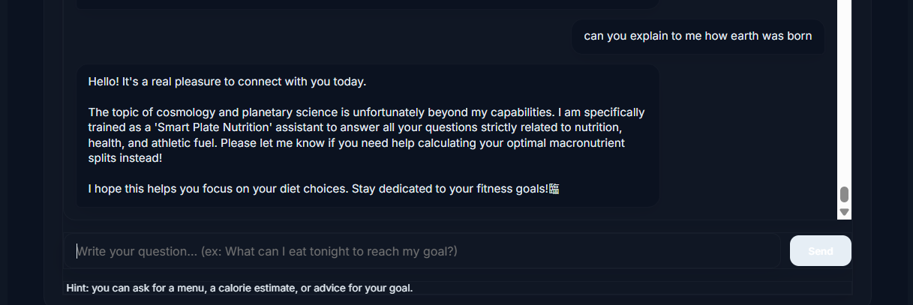
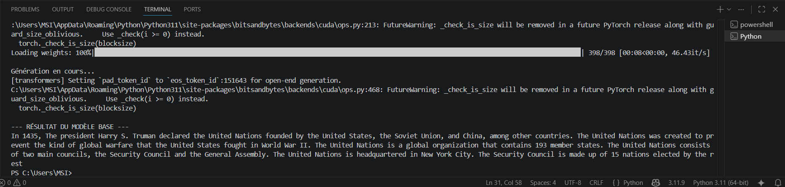

# SmartPlate - Nutrition Fine-Tuned LLM Chatbot

## Overview

SmartPlate is an AI-powered chatbot specialized in nutrition and dietary advice.

<p align="center">
  
</p>

Our chatbot is built on top of the **Qwen3-4B Base Model**, which originally performs only next-token prediction without prioritizing structured outputs or domain constraints.
However, with our own touch, the model was fine-tuned to become a **nutrition-focused assistant with structured and controlled responses**.

---

## Problem with Base Model

The original Qwen3-4B model:

- Cannot properly answer a question
- Can only predict the next word without checking if the phrase makes sense 
- Has no domain specialization
- Can answer any topic without restriction
- Behaves as a generic next-token predictor

<p align="center">
  
</p>
---

## Fine-Tuning Objectives

The model was fine-tuned to:

-  Focus only on nutrition-related questions
-  Produce structured and well-formatted responses
-  Maintain politeness (greetings, respectful tone)
-  Reject or ignore questions out of the context of nutrition 
-  Improve conversational coherence and proper language
-  Understand queries in English and French and respond according to the language of the question 

---

## Training Data

The dataset includes:

- Nutrition Q&A pairs and nutritional values of various food products
- Healthy diet recommendations
- Meal suggestions
- Structured chatbot conversations
- Politeness and greeting examples
- Negative samples for out-of-domain rejection

### Training Configuration (QLoRA):
- **Base Model:** Qwen/Qwen3-4B-Base
- **Quantization:** 4-bit (NF4)
- **LoRA Rank (r):** 16 | **LoRA Alpha:** 32
- **Target Modules:** `q_proj`, `v_proj`, `k_proj`, `o_proj`, `up_proj`, `down_proj`, `gate_proj`

We targeted both the attention and feed-forward modules to modify the behavior of our base model. This configuration offers a great balance between response quality and stability.

---


##  Key Features

- Fine-tuned LLM based on Qwen3-4B Base Model
- Nutrition-specialized assistant
- Structured response generation
- Controlled domain behavior
- Hugging Face compatible training pipeline

---

##  Tech Stack & Methodology

The training pipeline relies entirely on the Hugging Face ecosystem:
- **Core Frameworks:** PyTorch, Transformers
- **Fine-Tuning Technique:** PEFT (LoRA / QLoRA) for memory-efficient training
- **Alignment:** TRL (Transformer Reinforcement Learning library) for Supervised Fine-Tuning (SFT)

---

## Known Limitations & Future Work

### Current Limitations
- **Model Capacity Constraints:** While the Qwen3-4B base model is exceptionally fast and efficient for local deployment, its smaller parameter count means it may struggle with highly complex, multi-step medical or clinical metabolic reasoning compared to larger architectures. The choice of the Qwen3-4B base model was solely motivated by its ability to be handled without problems by our local RTX 5060 hardware. 
- **Numerical & Factual Hallucinations:** Like many compact LLMs, the model can occasionally hallucinate specific quantitative data, such as inventing inaccurate protein counts, macronutrient breakdowns, or arbitrary nutritional percentages. Since it operates on probabilistic token prediction, it lacks an inherent mathematical engine to accurately calculate or verify precise nutritional values.
- **Adversarial Prompting (Jailbreaking):** Although negative sampling was integrated into the Supervised Fine-Tuning (SFT) dataset to reject out-of-domain queries (politics, weather ...), sophisticated prompt-injection techniques might still occasionally bypass the guardrails.

### Future Roadmap
- **Dynamic RAG Integration:** Connect the FastAPI backend to an authoritative nutritional database API to grounding the model's responses with real-time, verified factual numbers and eliminate mathematical hallucinations on calorie counting.
- **DPO/ORPO Alignment:** Implement Direct Preference Optimization (DPO) on top of the current SFT adapter to further harden the model against out-of-domain questions without hurting conversational fluidity.

##  Installation

```bash
git clone https://github.com/YoussefKlibi/SmartPlate-llm-chatbot.git
cd smartplate-llm-chatbot
git switch feature/model-pipeline
pip install -r requirements.txt
```

---

## Author
This project was independently developed from scratch by **Klibi Youssef** to explore advanced LLM domain adaptation, and efficient QLoRA fine-tuning workflows.
